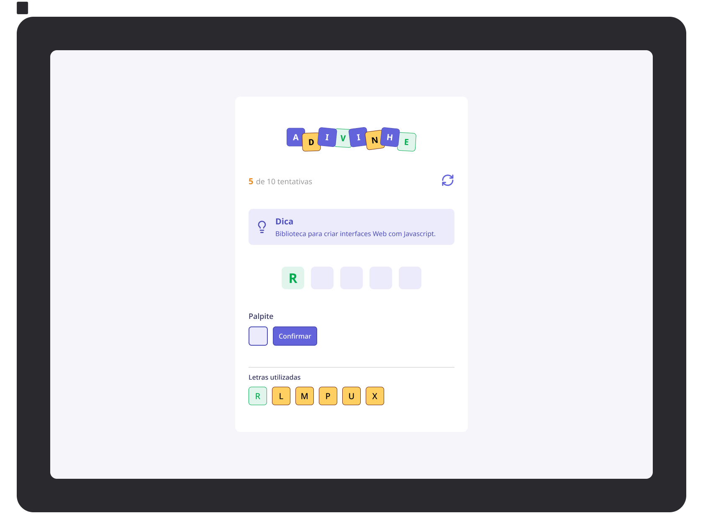

# 🎯 Advinhe! || Guess!

<div align="center">
  
</div>

<div align="center">
  <h3>🎮 Um jogo de adivinhação de palavras sobre tecnologia</h3>
  <p>Desenvolvido durante o curso FullStack da Rocketseat - Módulo: Iniciando com React</p>
</div>

<div align="center">
  
  
  
  
  
</div>

## 📝 Sobre o Projeto

**Advinhe!** é um jogo interativo de adivinhação onde o jogador precisa descobrir palavras relacionadas ao mundo da tecnologia com base em dicas fornecidas. O jogo apresenta uma interface moderna e intuitiva, onde você tem um número limitado de tentativas para acertar cada palavra.

### 🎯 Como Funciona

- 🔤 Adivinhe palavras sobre tecnologia (CSS, React, HTML, JavaScript, TypeScript)
- 💡 Receba dicas para ajudar na descoberta
- 🎮 Você tem até 10 tentativas para acertar cada palavra
- 📊 Acompanhe seu progresso em tempo real
- 🔄 Reinicie o jogo a qualquer momento

## 🚀 Tecnologias Utilizadas

- **[React](https://reactjs.org/)** - Biblioteca JavaScript para construção de interfaces
- **[TypeScript](https://www.typescriptlang.org/)** - Superset do JavaScript com tipagem estática
- **[Vite](https://vitejs.dev/)** - Build tool rápido e moderno
- **[CSS Modules](https://github.com/css-modules/css-modules)** - Para estilização modular

## 🛠️ Instalação e Execução

### Pré-requisitos

- **Node.js** 18+
- **npm** ou **yarn**

### Passo a passo

1. **Clone o repositório**

   ```bash
   git clone https://github.com/seu-usuario/guess.git
   cd guess
   ```

2. **Instale as dependências**

   ```bash
   npm install
   # ou
   yarn install
   ```

3. **Execute o projeto**

   ```bash
   npm run dev
   # ou
   yarn dev
   ```

4. **Acesse no navegador**
   ```
   http://localhost:5173
   ```

## 📦 Scripts Disponíveis

- `npm run dev` - Inicia o servidor de desenvolvimento
- `npm run build` - Gera a build de produção
- `npm run preview` - Visualiza a build de produção
- `npm run lint` - Executa o linter

## 🎨 Funcionalidades

- ✅ Interface responsiva e moderna
- ✅ Sistema de dicas inteligente
- ✅ Contador de tentativas
- ✅ Botão de reiniciar jogo
- ✅ Feedback visual para letras usadas
- ✅ Animações suaves

## 🤝 Contribuição

Contribuições são sempre bem-vindas! Para contribuir:

1. Faça um fork do projeto
2. Crie uma branch para sua feature (`git checkout -b feature/AmazingFeature`)
3. Commit suas mudanças (`git commit -m 'Add some AmazingFeature'`)
4. Push para a branch (`git push origin feature/AmazingFeature`)
5. Abra um Pull Request

## 📄 Licença

Este projeto está sob a licença MIT. Veja o arquivo [LICENSE](LICENSE) para mais detalhes.

## 👨‍💻 Autor

Desenvolvido com ❤️ durante o curso da **Rocketseat**

---

<div align="center">
  <p>⭐ Se este projeto te ajudou, deixe uma estrela!</p>
</div>
